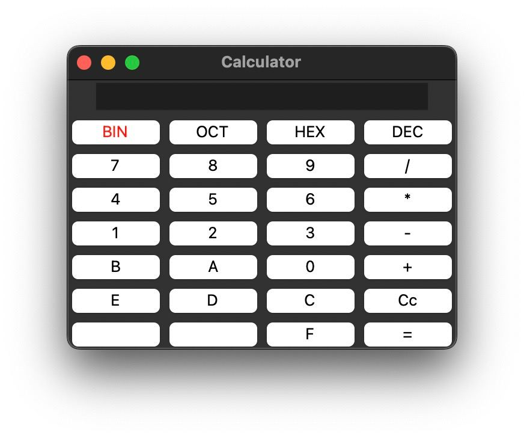

# numberbasecalc
1st task for descrete math 2024 class in NUST MISIS

### 💻 Технологии и библиотеки
- Python
- Tkinter

### Установка и запуск

1. Склонируйте проект на компьютер
2. Перейдите в папку /src проекта
```bash
cd numberbasecalc/src
```
3. Запустите проект
```bash
python3 calc.py
```

### Примеры использования
<div align='center' >

</div>

[Видео](https://drive.google.com/file/d/1gBhFLiifeKRr0qZH6w3jL9TKEGwjCBmn/view?usp=sharing)